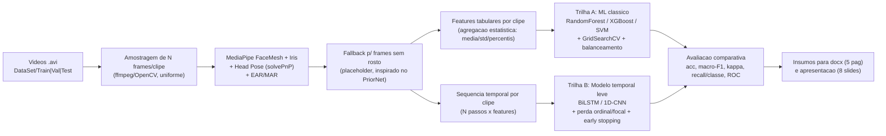

# Plano de Execução - Classificação de Engajamento em EaD com Visão Computacional

> Documento de trabalho para orientar a construção dos notebooks que geram evidência empírica para validar (ou refutar) a hipótese da mini-qualificação, e que servem de insumo direto para:
> 1. o documento `mini-qualificacao/INF-009 2026.2 - Template Mini-qualificacao.docx` (máx. 5 páginas);
> 2. uma apresentação de até 8 slides (10–15 min).

Última atualização: 31/07/2026 - baseado em inspeção real do repositório e em levantamento bibliográfico (IEEE/ACM/ScienceDirect/Scopus via consulta indireta + arXiv, 2024 em diante) realizado nesta sessão.

---

## 1. Diagnóstico do estado atual (fatos verificados no repositório)

| Item | Situação encontrada |
|---|---|
| Vídeos | Presentes fisicamente em `datasets/DAiSEE/DataSet/{Train,Test,Validation}/<user>/<clipId>/<clipId>.avi` |
| Rótulos | `datasets/DAiSEE/Labels/{AllLabels,TrainLabels,ValidationLabels,TestLabels}.csv` - 4 rótulos ordinais (0–3): Boredom, **Engagement**, Confusion, Frustration |
| Distribuição real de `Engagement` (AllLabels, n=8925) | Nível 0 (Muito Baixo) = **61 (0,68%)** · Nível 1 (Baixo) = **455 (5,1%)** · Nível 2 (Alto) = **4422 (49,5%)** · Nível 3 (Muito Alto) = **3987 (44,7%)** |
| Distribuição por split | Train n=5358, Val n=1429, Test n=1784 - mesma assimetria em todos (classes 0+1 somam <6% em cada split) |
| Scripts legados | `extractFrames.py` (extrai **todos** os frames via ffmpeg - caro em disco/tempo) e `hog.py` (features HOG por frame, abordagem de 2016) - **desatualizados**, serão substituídos |
| Ambiente Python | Python **3.14.4** default, sem nenhuma lib de ML/CV instalada. `pyenv` já tem **3.10** e **3.11** disponíveis. Recomenda-se venv em **3.11** (Mediapipe/Torch têm melhor suporte que em 3.14) |
| ffmpeg | Instalado (Chocolatey e WinGet) |
| GPU | **Nenhuma GPU NVIDIA detectada** (`nvidia-smi` ausente) → pipeline deve assumir **CPU-only** como cenário padrão, com nota de escalabilidade caso o aluno rode em Colab/Kaggle (GPU gratuita) |
| Pasta `notebooks/` | Vazia - notebooks-esqueleto criados como parte deste plano |

**Implicação prática:** o desenho da PoC precisa ser *leve o suficiente para rodar em CPU em poucas horas*, o que descarta treinar do zero arquiteturas pesadas (Video Transformers, Mamba, 3D-CNN completas). A estratégia (Seção 5) usa features compactas (landmarks/pose) + modelos leves, com um caminho opcional de fine-tuning leve se houver GPU disponível.

---

## 2. Objetivos mensuráveis (mapeados 1:1 para a proposta)

### Objetivo Geral
> Avaliar se indicadores visuais permitem identificar diferentes níveis de engajamento em aulas síncronas de EaD.

**Critério de validação mensurável:** o melhor modelo treinado deve superar, com significância estatística (IC 95% via bootstrap, 1000 reamostragens, não sobreposto), o baseline trivial "sempre prever a classe majoritária" nas métricas **macro-F1** e **Cohen's kappa** - não apenas em acurácia (que é enganosa dado o desbalanceamento de 94% nas classes 2+3).

- Baseline trivial esperado: acurácia ≈ 49,5%, macro-F1 ≈ 12%, kappa ≈ 0.
- Meta do PoC: macro-F1 ≥ 45% e kappa ≥ 0,25 (valores plausíveis dado o estado da arte 2024–2025, ver Seção 4).

### Objetivo Específico 1 - indicadores visuais mais relacionados ao engajamento/desengajamento/distração
**Mensurável:** gerar ranking de importância de features (`feature_importances_` de Random Forest/XGBoost + validação por permutação) para os 4 rótulos (Engagement, Boredom, Confusion, Frustration), com **estabilidade do top-5 em ≥ 4 de 5 folds** de validação cruzada estratificada. Entregável: tabela + gráfico de barras por rótulo (Notebook 03/05).

### Objetivo Específico 2 - capacidade de modelos baseados em marcos faciais diferenciarem engajados vs. desengajados
**Mensurável:** reformular como classificação binária (Engajado = níveis {2,3} vs. Desengajado = níveis {0,1}) e reportar **recall da classe minoritária (Desengajado) ≥ 60%** e **AUC-ROC ≥ 0,70**, comparando com o número base do baseline majoritário (recall ≈ 0%). Entregável: matriz de confusão binária + curva ROC (Notebook 05).

Esses três critérios são exatamente o que precisa ir na seção **"Objetivos"** do template (que exige objetivos "simples, mensuráveis e alcançáveis").

---

## 3. Estado da arte (2024 em diante) - o que já foi tentado no DAiSEE

Levantamento feito nesta sessão (arXiv como proxy de acesso rápido às mesmas publicações indexadas em IEEE Xplore/ScienceDirect/ACM DL/Scopus - vários destes são post-prints de artigos publicados nessas bases). Ordenado cronologicamente:

| Ano | Trabalho | Método / Pré-processamento | Resultado no DAiSEE (Engagement, 4 classes) | Contribuição / Limitação |
|---|---|---|---|---|
| 2016 | Gupta et al. - *DAiSEE: Towards User Engagement Recognition in the Wild* ([arXiv:1609.01885](https://arxiv.org/abs/1609.01885)) | Artigo original do dataset; benchmark **LRCN** (CNN + LSTM) fim-a-fim como baseline oficial | **57,9%** acurácia (Engagement) e 72,3% (Confusão) | Baseline histórico de referência do próprio dataset; sem tratamento de desbalanceamento nem de ordinalidade |
| 2021 | Abedi & Khan - *ResNet+TCN hybrid* ([arXiv:2104.10122](https://arxiv.org/abs/2104.10122)) | CNN 2D (ResNet) + Temporal Conv Network, fim-a-fim em frames brutos | Estabeleceu baseline histórico forte | Custo computacional alto; não trata desbalanceamento explicitamente |
| 2021 | Abedi & Khan - *Affect-driven Ordinal Engagement* ([arXiv:2106.10882](https://arxiv.org/abs/2106.10882)) | Estados afetivos (valência/arousal) + features comportamentais, modelos **ordinais** | **67,4%** acurácia | Primeiro a tratar engajamento como variável **ordinal** - alinhado à nossa hipótese |
| 2021 | Liao, Liang & Pan - *DFSTN (Deep Facial Spatiotemporal Network)* ([DOI:10.1007/s10489-020-02139-8](https://doi.org/10.1007/s10489-020-02139-8)) | SE-ResNet-50 pré-treinada (features espaciais faciais) + **LSTM com atenção global** | **58,84%** acurácia (Engagement) | Mostra ganho de atenção temporal sobre CNN pura, mas ainda distante do SOTA atual |
| 2022 | Ai et al. - *CavT (Class-Attention Video Transformer)* ([arXiv:2208.07216](https://arxiv.org/abs/2208.07216)) | Transformer de vídeo fim-a-fim + amostragem binária de sequências | MSE 0,0377 (regressão) - SOTA à época | Alto custo de treino; formulação por regressão dificulta comparação direta |
| 2022 | Mehta et al. - *3D DenseAttNet* ([DOI:10.1007/s10489-022-03200-4](https://doi.org/10.1007/s10489-022-03200-4)) | DenseNet 3D + **módulo de self-attention** sobre cubos de imagem (clipes) faciais | **78,58%** (Frustração) e **63,59%** (Engagement) por classe | Extração seletiva de características espaço-temporais; bom desempenho em classes de afeto, porém abaixo do SOTA em Engagement |
| 2023 | Abedi et al. - *Bag of States* ([arXiv:2301.06730](https://arxiv.org/abs/2301.06730)) | Bag-of-words de estados comportamentais/afetivos, **sem** modelar ordem temporal | **66,58%** acurácia | Mostra que modelar a ordem temporal pode não ser essencial - questiona premissa de modelos sequenciais pesados |
| 2023 | Sugihdharma & Bachtiar - *SAE-CNN (Scaled Dot-Product Attention CNN)* ([DOI:10.1145/3626641.3626938](https://doi.org/10.1145/3626641.3626938)) | **OpenFace** (marcos oculares + *gaze*) como única entrada → CNN + mecanismo de **atenção scaled dot-product** | **96,89%** (estados afetivos) e **95,81%** (níveis de engajamento) - maior acurácia entre os trabalhos revisados | Reforça a aposta deste PoC em **features oculares/gaze leves** (MediaPipe Iris, Seção 5); ⚠️ acurácia muito acima do restante da literatura (~60-75%) exige checar protocolo de avaliação (classes/split usados, ausência de macro-F1/kappa) antes de tomar como cota superior realista |
| **2024** | Abedi & Khan - *Facial Landmarks + ST-GCN* ([arXiv:2403.17175](https://arxiv.org/abs/2403.17175)) | **MediaPipe FaceMesh** (landmarks, sem PII) → Spatial-Temporal Graph Conv Network + **transfer learning ordinal** | SOTA em EngageNet (+3,1%) e Online Student Engagement (+1,5%) | Leve, tempo real, **privacy-preserving**; referência arquitetural central deste plano |
| **2024** | Malekshahi et al. - *A General Model for Detecting Learner Engagement* ([arXiv:2405.04251](https://arxiv.org/abs/2405.04251)) | Seleção leve de features + política de adaptação de rótulos | **68,57%** acurácia | Modelo leve supera SOTA da época; falta relato de macro-F1/kappa |
| **2024** | Shiri et al. - *ConvNeXtLarge + Ensemble Bi-GRU* ([DOI:10.1109/ICIET60671.2024.10542707](https://doi.org/10.1109/ICIET60671.2024.10542707)) | **ConvNeXtLarge** (backbone espacial) + ensemble de **GRU/Bi-GRU** (temporal), classificação multi-rótulo por classe | **79,32%** (Frustração) e **70,18%** (Confusão) por classe | Híbrido espaço-temporal robusto por classe, mas custo computacional alto (backbone pesado) para o cenário CPU-only deste PoC |
| **2024** | Qiao, Guan & Wang - *MLPC (Multi-Layer Perceptron Classifier)* ([DOI:10.1145/3687311.3687372](https://doi.org/10.1145/3687311.3687372)) | MTCNN + CE-CLM/OpenPose (marcos faciais/corporais) → fusão ponderada por correlação + **MLP** leve | **MSE 0,0353** (regressão de concentração) - menor erro entre os trabalhos revisados; treina 200 amostras em <30s | Extremamente **eficiente computacionalmente** - evidência direta de que features tabulares leves + modelo simples são viáveis em CPU, validando a Trilha A deste plano |
| **2024** | Singh et al. - *VisioPhysioENet* ([arXiv:2409.16126](https://arxiv.org/abs/2409.16126)) | Landmarks (Dlib) + sinais fisiológicos rPPG (POS) + classificadores de ML | **63,09%** acurácia | Fusão multimodal ganha pouco (+8,6% vs. 1 modal) a um custo alto - **baixo custo-benefício** para PoC |
| **2024** | Gogawale et al. - *Learner Attentiveness Analysis* ([arXiv:2412.00429](https://arxiv.org/abs/2412.00429)) | CNN multi-classe/multi-saída + índice de atenção agregado | Reporta superioridade qualitativa, sem número único direto | Pipeline fim-a-fim, mas não reporta métricas de classe minoritária |
| **2025** | Mandia et al. - *EngageFormer* ([arXiv:2502.10813](https://arxiv.org/abs/2502.10813)) | Transformer multi-view (3 vistas) + sequence pooling | **63,9%** acurácia no DAiSEE | Bom desempenho cross-dataset, mas custo de treino de transformer do zero |
| **2025** | Safa, Abedi & Khan - *Supervised Contrastive Ordinal Learning* ([arXiv:2505.20676](https://arxiv.org/abs/2505.20676)) | Contrastive learning supervisionado + **aumento de dados temporal** para classes ordinais desbalanceadas | Ganhos relatados sobre baselines ordinais | Ataca **exatamente** o gap de desbalanceamento + ordinalidade - referência-chave |
| **2025** | Gothwal et al. - *ViBED-Net* ([arXiv:2510.18016](https://arxiv.org/abs/2510.18016)) | Dual-stream **EfficientNetV2** (face + cena) + LSTM/Transformer + aumento de dados dirigido às classes raras | **73,43%** acurácia (variante LSTM) - **melhor número recente encontrado** | Estado da arte atual reportado; ainda usa só acurácia como métrica principal |
| 2026 | Vedernikov - *PriorNet* ([arXiv:2605.03615](https://arxiv.org/abs/2605.03615)) | Backbone auto-supervisionado (SVFAP) + **Prior-LoRA** + perda evidencial (Dirichlet) com incerteza | Supera referência interna em 4 datasets (EngageNet, DAiSEE, DREAMS, PAFE) | Trata explicitamente frames sem rosto detectado - problema real do DAiSEE ("in the wild") |
| 2026 | Vedernikov - *Machine Unlearning para rótulos ruidosos* ([arXiv:2605.04713](https://arxiv.org/abs/2605.04713)) | TCCT-Net como plataforma; remoção pós-hoc de sujeitos problemáticos | Recupera 89–93% do ganho de um retrain completo | Evidencia que **ruído de rótulo por sujeito** é um problema relevante no DAiSEE |
| 2026 | Goyal et al. - *Zero-Shot VLM Benchmark* ([arXiv:2606.21861](https://arxiv.org/abs/2606.21861)) | CLIP, BLIP-VQA, GPT-4o, LLaVA-1.5, Qwen2.5VL em **zero-shot**, sem fine-tuning | Kappa **< 0,10** no DAiSEE; colapso de classe (85–100% das predições numa única classe) | **Evidência direta de que "prompting" de modelos de fundação não funciona** para este problema - justifica investir em fine-tuning/treino supervisionado, não em LLMs genéricos |
| 2026 | Ainebyona et al. - *MobileNetV2 fine-tuned* ([arXiv:2601.08049](https://arxiv.org/abs/2601.08049)) | MobileNetV2 fine-tuned num sistema IoT de sala de aula | 89,5% (⚠️ tarefa/rotulagem não claramente comparável ao protocolo oficial 4-classes) | Serve de **alerta metodológico**: números muito altos sem relato de matriz de confusão/kappa são suspeitos de artefato de desbalanceamento |

**Citação complementar da literatura já levantada pela proponente** (KE et al. 2025 - Mamba; WANG et al. 2025 - MediaPipe multi-feature; SAVCHENKO et al. 2022; RAHMAN et al. 2025; GOH et al. 2025 - YOLOv8) permanece válida como contexto de fronteira tecnológica, mas **arquiteturas tipo Mamba/Video-Transformer de ponta são desproporcionais ao baixo uso de CPU** - tratadas como trabalho futuro na dissertação, não neste PoC.

---

## 4. Lacunas identificadas e aposta metodológica do PoC

| Lacuna na literatura | Como este PoC ataca a lacuna |
|---|---|
| **Métrica única (acurácia)** domina os artigos; poucos relatam macro-F1/kappa/recall por classe | Protocolo de avaliação obrigatório reporta acurácia, **macro-F1, kappa, balanced accuracy, recall por classe e matriz de confusão** em todo experimento (Seção 6) |
| Desbalanceamento extremo (0,68%/5,1% nas classes raras) é subtratado ou ignorado | Comparação sistemática de **class-weight, focal loss, oversampling (SMOTE sobre features tabulares) e undersampling**, com ablação explícita |
| Poucos trabalhos exploram a **ordinalidade** do rótulo de forma simples e barata | Testar **perda ordinal (CORAL / cumulative logits)** vs. softmax padrão, comparando ganho real em kappa |
| Modelos de ponta (SVFAP+LoRA, Mamba, Video Transformer) exigem GPU/tempo que não cabem em um curto prazo para treinamento | Pipeline **leve**: landmarks/pose do MediaPipe (sem PII, tempo real, CPU-friendly) + classificadores clássicos e um modelo temporal raso (BiLSTM/1D-CNN), inspirado no ST-GCN de Abedi & Khan (2024) |
| Fusão fisiológica (rPPG) tem custo alto para ganho baixo (+8,6% relativo, ~63% absoluto) | **Não priorizada** no PoC; citada como trabalho futuro |
| Zero-shot com LLMs/VLMs falha (kappa<0,10) | Reforça a escolha por **fine-tuning/treino supervisionado**, não por prompting de modelos de fundação |
| Ruído de rótulo por sujeito não é tratado na maioria dos trabalhos | Análise exploratória por sujeito (Notebook 01) reporta se há sujeitos com padrões atípicos, como checagem de robustez |
| Modelos leves (MLP/CNN rasa) sobre poucas features às vezes são descartados a priori em favor de arquiteturas pesadas, mesmo quando atingem bons resultados a baixo custo (SAE-CNN 2023 com apenas landmarks/gaze oculares; MLPC 2024 com MLP simples e treino em segundos) | Reforça a aposta em **features compactas de marcos faciais/oculares** (MediaPipe FaceMesh + Iris, Seção 5) e em classificadores leves como primeira trilha (Trilha A), antes de escalar para modelos temporais mais custosos |

**Aposta do PoC:** combinar (a) features de marcos faciais/pose 2024-style (barato, privacy-preserving, real-time) - incluindo marcos e *gaze* oculares (MediaPipe Iris), na linha do que Sugihdharma & Bachtiar (2023, SAE-CNN) exploraram com OpenFace - com (b) tratamento explícito e comparado de desbalanceamento + ordinalidade e (c) protocolo de avaliação mais rigoroso (múltiplas métricas) do que a maioria da literatura - não necessariamente para bater o número absoluto de acurácia do ViBED-Net (73,43%) ou do SAE-CNN (95,81%, cujo protocolo de avaliação precisa ser verificado antes de ser tomado como cota superior realista), mas para produzir uma análise **mais robusta e honesta**, que é exatamente o tipo de contribuição incremental esperada de uma mini-qualificação.

---

## 5. Arquitetura da solução (pipeline)

---

## 6. Protocolo experimental (obrigatório em todos os notebooks de modelagem)

1. **Splits oficiais do DAiSEE** (Train/Validation/Test por sujeito) - nunca misturar sujeitos entre splits, para permanecer comparável à literatura.
2. **Amostragem de frames:** N fixo por clipe (sugestão inicial: 20 frames uniformemente espaçados) em vez de extrair todos os frames (ao contrário do `extractFrames.py` legado) - necessário para caber no orçamento de tempo/disco.
3. **Tratamento de desbalanceamento:** testar ao menos 3 estratégias e comparar: (i) baseline sem tratamento, (ii) `class_weight='balanced'` / focal loss, (iii) oversampling (SMOTE em features tabulares) - nunca fazer oversampling causando vazamento entre train/val/test.
4. **Ordinalidade:** comparar classificação nominal padrão vs. formulação ordinal (CORAL ou regressão ordinal simples).
5. **Validação de hiperparâmetros:** `GridSearchCV` (ML clássico) com validação cruzada estratificada **dentro do Train**; **early stopping** monitorando macro-F1 de validação (não loss) para o modelo DL.
6. **Métricas obrigatórias em todo relatório:** acurácia, macro-F1, Cohen's kappa, balanced accuracy, recall por classe, matriz de confusão; para a versão binária (Objetivo 2): recall da classe minoritária + AUC-ROC.
7. **Intervalo de confiança:** bootstrap (≥500 reamostragens) sobre o conjunto de teste para macro-F1 e kappa do melhor modelo, para sustentar a comparação com o baseline trivial (Seção 2).
8. **Reprodutibilidade:** seed fixa (`random_state=42`) em todos os notebooks; `requirements.txt` com versões fixadas; registrar tempo de execução de cada etapa.

---

## 7. Ambiente técnico

- Criar ambiente virtual dedicado em **Python 3.11** (via `py -3.11 -m venv .venv`), evitando o Python 3.14 default por risco de incompatibilidade com MediaPipe/Torch.
- Dependências principais (arquivo `requirements.txt` já criado na raiz do repositório): `opencv-python`, `mediapipe`, `pandas`, `numpy`, `scikit-learn`, `xgboost`, `imbalanced-learn`, `torch`, `matplotlib`, `seaborn`, `tqdm`, `pyarrow`, `shap`.
- ffmpeg já está disponível no PATH (Chocolatey/WinGet) - usado apenas para amostragem seletiva de frames (não extração total).
- Sem GPU local: todo o treino deve ser viável em CPU; se o aluno tiver acesso a Google Colab/Kaggle (GPU gratuita), o Notebook 04 tem uma seção opcional de fine-tuning de um backbone CNN pré-treinado leve (ex.: MobileNetV3/EfficientNet-B0) como *stretch goal*.

---

## 8. Notebooks a construir (`notebooks/`)

Os seis notebooks abaixo foram criados como esqueletos executáveis (`00`–`05`), com células de markdown explicando cada etapa e código inicial funcional onde possível. Tempo estimado assume execução em CPU comum.

| # | Notebook | Objetivo | Saída | Tempo estimado |
|---|---|---|---|---|
| 00 | `00_setup_ambiente.ipynb` | Validar ambiente (versões, GPU, ffmpeg, paths do dataset) | Relatório de diagnóstico | 15–30 min |
| 01 | `01_analise_exploratoria.ipynb` | EDA: distribuição de classes, duração/resolução, "buracos" no dataset, correlação entre rótulos, análise por sujeito | Figuras + tabelas de distribuição | 1–1,5 h |
| 02 | `02_preprocessamento_landmarks.ipynb` | Amostragem de frames + extração de landmarks/pose/EAR/MAR via MediaPipe, com fallback para frames sem rosto | `features/*.parquet` por split | 2,5–4 h (rodar piloto de ~200 vídeos antes do full-run) |
| 03 | `03_baseline_classico.ipynb` | Features agregadas por clipe → RandomForest/XGBoost/SVM, GridSearchCV, comparação de balanceamento, importância de features (Objetivo 1) | Métricas + ranking de features | 1,5–2 h |
| 04 | `04_modelo_temporal_dl.ipynb` | Sequência temporal por clipe → BiLSTM/1D-CNN, perda focal/ordinal, early stopping; seção opcional de fine-tuning de CNN leve (se GPU) | Métricas + curvas de treino | 2,5–3,5 h |
| 05 | `05_avaliacao_comparativa.ipynb` | Consolidar Trilha A vs. B vs. literatura; ablações (balanceamento, ordinalidade); versão binária (Objetivo 2); bootstrap CI; geração de figuras/tabelas finais | Tabelas/figuras para docx e slides | 1,5–2 h |

---

## 9. Cronograma detalhado (2 dias, ~8h/dia com apoio de IA)

```mermaid
gantt
    title Cronograma de execucao (2 dias)
    dateFormat  HH:mm
    axisFormat  %H:%M
    section Dia 1
    Setup ambiente (Nb 00)            :d1a, 08:00, 30m
    EDA completa (Nb 01)              :d1b, after d1a, 90m
    Piloto pre-processamento (~200 videos) :d1c, after d1b, 90m
    Full-run pre-processamento (Nb 02, background) :d1d, after d1c, 150m
    Baseline classico (Nb 03)         :d1e, after d1d, 90m
    section Dia 2
    Modelo temporal DL (Nb 04 parte 1)   :d2a, 08:00, 150m
    Variante ordinal + comparacao        :d2b, after d2a, 60m
    Ablacoes de balanceamento/ordinalidade :d2c, after d2b, 90m
    Consolidacao e comparacao com literatura (Nb 05) :d2d, after d2c, 90m
    Insumos p/ docx e slides             :d2e, after d2d, 90m
```

**Gatilhos de fallback (para não estourar o prazo de 2 dias):**
- Se o pré-processamento completo (>8900 clipes) não terminar a tempo → usar amostra estratificada (ex.: 30% por split, preservando proporção de classes) e documentar como limitação explícita do PoC.
- Se o modelo DL (Notebook 04) não convergir bem em CPU → priorizar a Trilha A (ML clássico), que já responde aos 2 objetivos específicos, e reportar a Trilha B como "resultado preliminar/trabalho em andamento".
- Se MediaPipe falhar em muitos frames (baixa qualidade "in the wild") → registrar taxa de detecção de rosto por split (métrica adicional relevante para a seção de limitações).

---

## 10. Critérios de validação da hipótese

A hipótese da proposta ("indicadores visuais... permitem identificar níveis de engajamento com maior precisão e objetividade... "), no escopo desta PoC, será considerada:

- **Corroborada** se o melhor modelo superar o baseline trivial em macro-F1 e kappa com IC 95% não sobreposto (Seção 2) **e** o recall da classe "Desengajado" (binário) for ≥ 60%.
- **Parcialmente corroborada** se houver ganho estatisticamente significativo em kappa/macro-F1, mas o recall da classe minoritária ficar abaixo da meta - sinalizando que o desbalanceamento extremo (0,68% na classe mais rara) ainda é o principal fator limitante, mesmo com todas as mitigações testadas.
- **Não corroborada** se nenhum modelo superar o baseline trivial com significância - nesse caso, o Notebook 05 deve investigar se o problema é de features (landmarks insuficientes) ou de dados (ruído de rótulo, conforme apontado por Vedernikov 2026).

Qualquer um dos três desfechos é publicável na mini-qualificação - o critério de "mensurável e alcançável" do template está satisfeito porque o desfecho é definido *a priori*.

---

## 11. Mapeamento direto para o template da mini-qualificação (máx. 5 páginas)

Template oficial: `mini-qualificacao/INF-009 2026.2 - Template Mini-qualificacao.docx` (Pós-graduação em Engenharia da Informação, UFABC, quadrimestre 2026.2).

**Folha de rosto:** Universidade Federal do ABC · Pós-graduação em Engenharia da Informação · INF-009 – Projeto e Comunicação de Pesquisa em Engenharia da Informação · Quadrimestre 2026.2 · título da mini-qualificação · nome completo do aluno (e-mail@ufabc.edu.br) · local e data.

| Seção do template | Critério exigido pelo template | Fonte no plano/notebooks |
|---|---|---|
| 1. Resumo (≤10 linhas) | Deve cobrir 4 pontos: Contexto (área de pesquisa), Problema/Desafio (o que não está resolvido na literatura), Solução/proposta (como pretende resolver) e Avaliação (como pretende demonstrar que a solução resolve o problema) | Síntese do Notebook 05 (resultado final + hipótese corroborada/parcial/não), usando Contexto = Seção 1, Problema = Seção 4 (lacunas), Solução = Seção 5 (pipeline), Avaliação = Seção 6 (protocolo) e Seção 10 (critérios de corroboração) |
| 2. Introdução e Motivação | Expandir o resumo com foco em Problema de pesquisa (questões de pesquisa e/ou hipótese - a hipótese pode se provar válida ou não) e Contribuições esperadas (como o conhecimento na área será expandido) | Seções 1–2 deste plano (diagnóstico + hipótese + objetivos mensuráveis); contribuição esperada = protocolo de avaliação mais rigoroso (Seção 4) |
| 3. Estado da Arte e Trabalhos Relacionados | Dissertar sobre a fronteira do conhecimento que o projeto pretende expandir; citar trabalhos relacionados enfatizando em que sentido o projeto se diferencia deles rumo às contribuições pretendidas | Tabela da Seção 3 (reduzir para 6–8 referências mais relevantes + 1 frase de gap/diferenciação por linha, cruzando com a Seção 4) |
| 4. Objetivos | Objetivo geral e específicos devem ser Simples e claros (dizer claramente o que se pretende realizar), Mensuráveis (possível medir/avaliar quando o objetivo é atingido) e Alcançáveis (compatíveis com o prazo do projeto) | Seção 2 deste plano (geral + 2 específicos, cada um já com critério mensurável e prazo compatível com o cronograma da Seção 9) |
| 5. Metodologia, Plano de Trabalho e Cronograma | Apresentar o método de trabalho adotado, o plano de trabalho (com tarefas específicas) e o cronograma de execução (contido no prazo do mestrado/doutorado) | Seções 5–9 (diagrama de pipeline, protocolo experimental, tabela de notebooks como plano de trabalho, cronograma Gantt de 2 dias como recorte do PoC dentro do prazo do mestrado) |
| 6. Referências | Lista numerada ([1], [2], ...) | Lista consolidada (proposta original + referências da Seção 3, todas com link arXiv/DOI) |

---

## 12. Estrutura da apresentação (8 slides, 10–15 min)

1. **Título + contexto do problema** (fadiga docente, evasão em EaD)
2. **Hipótese e objetivos mensuráveis** (geral + 2 específicos)
3. **Estado da arte 2021→2026** (linha do tempo curta com os 4–5 marcos da tabela da Seção 3)
4. **Lacunas exploradas** (métrica única, desbalanceamento, ordinalidade, custo computacional)
5. **Metodologia/Pipeline** (diagrama da Seção 5)
6. **Resultados** (tabela comparativa Trilha A vs. B vs. literatura + matriz de confusão + ranking de features)
7. **Discussão** (hipótese corroborada/parcial/não - critério da Seção 10 - limitações: CPU-only, amostragem de frames, desbalanceamento residual)
8. **Conclusão e próximos passos** (rumo à dissertação: datasets adicionais, GPU, arquiteturas mais pesadas como Mamba/SVFAP+LoRA)

---

## 13. Checklist final de entrega

- [ ] `requirements.txt` na raiz, com versões fixadas
- [ ] Notebooks `00`–`05` executam do início ao fim sem erro, com seed fixa
- [ ] Todas as métricas obrigatórias (Seção 6, item 6) reportadas em cada experimento
- [ ] Tabela comparativa final vs. literatura (Seção 3) incluída no Notebook 05
- [ ] Limitações documentadas explicitamente (amostragem de frames, CPU-only, taxa de detecção de rosto do MediaPipe)
- [ ] Insumos extraídos para as 6 seções do docx (Seção 11) e para os 8 slides (Seção 12)
- [ ] Referências com links/DOI válidos incluídas no docx final
